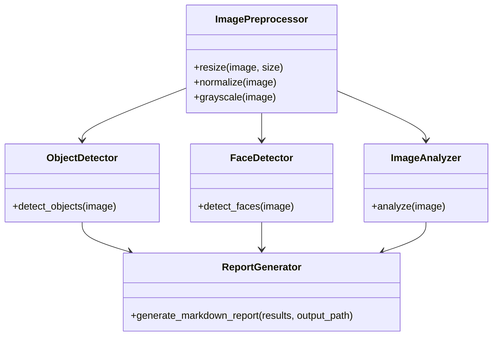

# Class Diagram

```mermaid
classDiagram
    class ImagePreprocessor {
        +resize(image, size)
        +normalize(image)
        +grayscale(image)
    }

    class ObjectDetector {
        +detect_objects(image)
    }

    class FaceDetector {
        +detect_faces(image)
    }

    class ImageAnalyzer {
        +analyze(image)
    }

    class ReportGenerator {
        +generate_markdown_report(results, output_path)
    }

    ImagePreprocessor --> ObjectDetector
    ImagePreprocessor --> FaceDetector
    ImagePreprocessor --> ImageAnalyzer
    ObjectDetector --> ReportGenerator
    FaceDetector --> ReportGenerator
    ImageAnalyzer --> ReportGenerator
```
