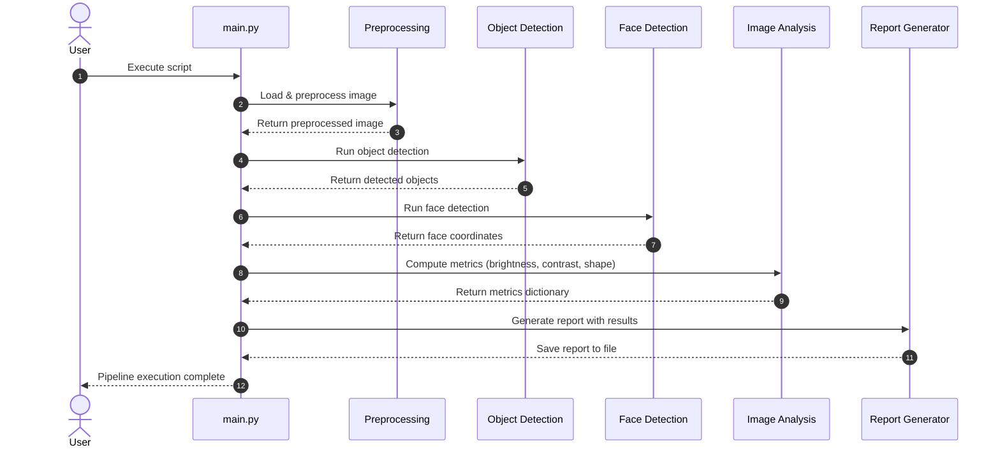

# Sequence Diagram

```mermaid
sequenceDiagram
    autonumber
    actor User
    participant Main as main.py
    participant Pre as Preprocessing
    participant Obj as Object Detection
    participant Face as Face Detection
    participant Ana as Image Analysis
    participant Rep as Report Generator

    User->>Main: Execute script
    Main->>Pre: Load & preprocess image
    Pre-->>Main: Return preprocessed image
    Main->>Obj: Run object detection
    Obj-->>Main: Return detected objects
    Main->>Face: Run face detection
    Face-->>Main: Return face coordinates
    Main->>Ana: Compute metrics (brightness, contrast, shape)
    Ana-->>Main: Return metrics dictionary
    Main->>Rep: Generate report with results
    Rep-->>Main: Save report to file
    Main-->>User: Pipeline execution complete
```
