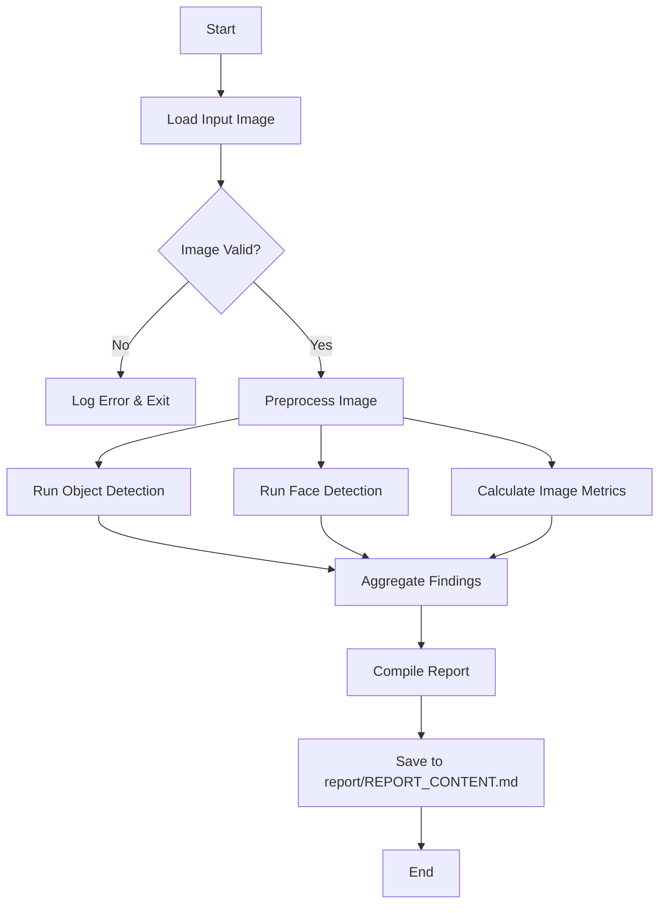

# Workflow Diagram

```mermaid
flowchart TD
    A[Start] --> B[Load Input Image]
    B --> C{Image Valid?}
    C -- No --> D[Log Error & Exit]
    C -- Yes --> E[Preprocess Image]
    E --> F[Run Object Detection]
    E --> G[Run Face Detection]
    E --> H[Calculate Image Metrics]
    F --> I[Aggregate Findings]
    G --> I
    H --> I
    I --> J[Compile Report]
    J --> K[Save to report/REPORT_CONTENT.md]
    K --> L[End]
```
